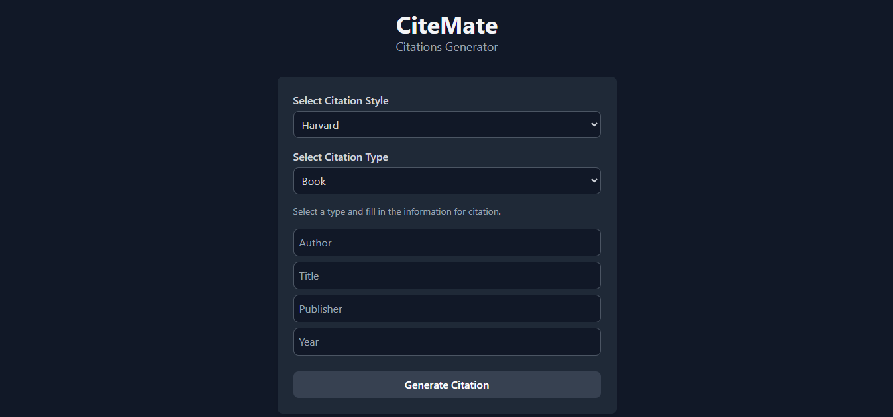

# CiteMate

A modern, user-friendly citation generator for students and researchers. Generate accurate citations across multiple styles with ease.



## ✨ Features

- **Multiple Citation Styles**
  - Harvard
  - IEEE
  - APA 7th Edition
  - APA 6th Edition
  - MLA

- **Diverse Source Types**
  - Books
  - Websites
  - Journal Articles
  - Blog Posts
  - Movies
  - Wikipedia Articles

- **User-Friendly Tools**
  - One-click citation copying
  - Bulk export to .txt
  - Clean, responsive interface
  - Real-time preview

## 🚀 Quick Start

### Prerequisites

- Git
- Node.js & npm (optional, for local Tailwind CSS builds)
- Web browser

### Installation

1. Clone the repository
   ```bash
   git clone https://github.com/your-username/CiteMate.git
   cd CiteMate
   ```

2. For local Tailwind CSS development (optional)
   ```bash
   npm install
   ```

3. Launch the application
   - Open `index.html` in your browser, or
   - Use VS Code's Live Server extension

## 📖 Usage

1. **Select Citation Style**
   - Choose from Harvard, IEEE, APA, or MLA

2. **Choose Source Type**
   - Select the appropriate source format (book, website, etc.)

3. **Enter Source Details**
   - Fill in the required fields for your source

4. **Generate & Export**
   - Click "Generate" to create your citation
   - Use "Copy" for individual citations
   - "Export" to download all citations as .txt

## 🛠️ Tech Stack

- HTML5
- Tailwind CSS (via CDN)
- Vanilla JavaScript
- Font Awesome Icons

## 🔗 Live Demo

Try CiteMate now at [Live Demo](https://citemate.netlify.app)

## 📜 License

CiteMate is protected under the CiteMate License. This license permits:
- Viewing the source code
- Using the application
- Drawing inspiration from the codebase

But prohibits:
- Modification of the source code
- Redistribution under a different name
- Commercial use without permission

## 🤝 Contributing

While we're not accepting direct contributions at this time, we welcome:
- Bug reports
- Feature suggestions
- Usage feedback

---

Developed with ❤️ for the academic community
